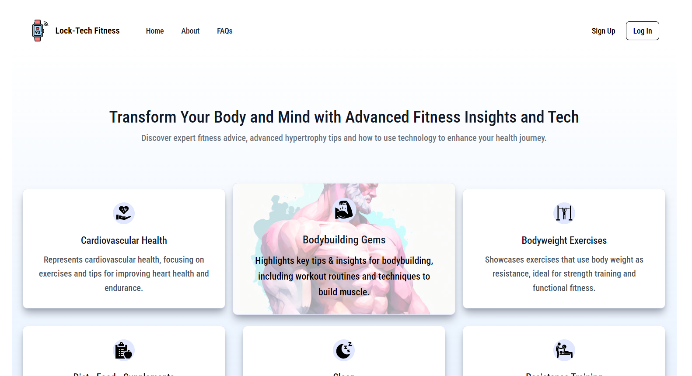

[Lock-Tech Fitness](https://github.com/Anubhav990/lock-TechFitness) is an advanced modern Fitness Blog Web App built with React.js, Tailwind CSS and Supabase.

<!-- some description about my project -->
Welcome to the Lock-Tech Fitness Blog Web App! This cutting-edge platform offers a modern and interactive experience for fitness enthusiasts. Sign up for free and explore the world of fitness with comprehensive insights on healthy living, advanced tailored workout routines, and innovative ways to leverage AI and technology for achieving a fit body and mind. Our app is designed to keep you motivated and informed on your journey to a healthier lifestyle.

# Live Preview:

Link:  https://lock-tech-fitness.vercel.app/


# Installation

To get started with the project, follow these steps:

- Clone the repository:

```bash
git clone https://github.com/Anubhav990/lock-TechFitness.git
```

- Navigate to the project directory:

```bash
cd lock-TechFitness
```

- Install dependencies:

```bash
npm install
```

- Start the development server:

```bash
npm run dev
```


# Used libraries and tools

- React.js: For building dynamic user interfaces.
  
- Tailwind CSS: For modern and latest, responsive design 
  
- Supabase: For backend services, real-time data and user authentication.
  
- SVGs: Sourced from various websites, including Flaticons.
  
- React Router DOM: For handling routing and navigation.
  
  - **Link**: For navigation between routes.
  - **NavLink**: For navigation with styling based on active state.
  
- React Portal: For creating modal windows and overlay components.
  
- JavaScript: The core language for building interactive web applications.
  
- React Hooks: Utilizing various hooks for state management and side effects.
  
  - **useState**: For managing local state within components.
  - **useEffect**: For performing side effects in functional components.
  - **useNavigate**: For programmatic navigation within the app.
  

# Components

Standalone Components
These components are directly located in the components/ folder:

- Content.jsx
- FAQ.jsx
- FAQTWO.jsx
- TechContent.jsx

Folder-Based Components
These components are organized within nested folders inside the components/ folder:

- About.
- blog
- footer
- header
- layout
- login
- logoutmodal
- scrolltotop
- signup
- techblog


# Supabase Client Configuration

The 'supabaseClient.js' file is responsible for initializing and configuring the Supabase client used in the application. This file sets up the connection to Supabase using variables obtained from the Supabase dashboard.

Configuration

- Development Environment: Supabase environment variables are stored in a .env file at the root of the project. This file includes sensitive information such as the Supabase URL and API key, necessary for connecting to Supabase.
- Production Environment: For deployment, environment variables are configured through Vite’s environment variable system. These variables are securely injected into the build process and used to connect to Supabase without exposing sensitive information in the codebase.

Environment Variables

- VITE_SUPABASE_URL: The URL of your Supabase instance.
- VITE_SUPABASE_ANON_KEY: The public API key used to access your Supabase instance.
